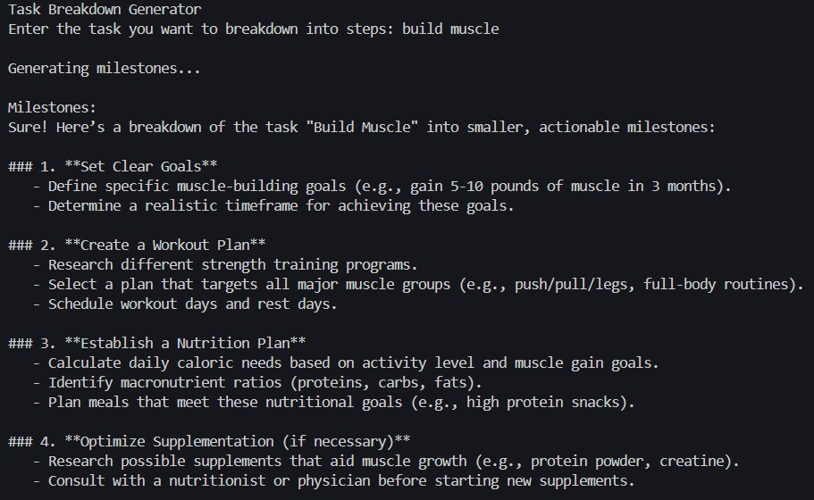

# Task Breakdown App

This application helps users break down tasks into smaller, manageable milestones. It uses OpenAI's GPT model to generate task breakdowns based on user input. The app is available in two formats: a Streamlit web application and a console application.

## Features

-   Task input through a user-friendly interface
-   AI-powered task breakdown generation
-   Available as both a web app and a console app

## Screenshots

### Streamlit Web App


### Console App



## Installation

1. Clone this repository:

2. Install the required dependencies:

    ```
    pip install -r requirements.txt
    ```

3. Set up your OpenAI API key:
    - Create a `.env` file in the root directory
    - Add your OpenAI API key to the file:
        ```
        OPENAI_API_KEY=your_api_key_here
        ```

## Usage

### Streamlit Web App

To run the Streamlit web app:

```
streamlit run app.py
```

Then open your web browser and navigate to the URL provided by Streamlit (usually `http://localhost:8501`).

### Console App

To run the console app:

```
python app.py
```

Follow the prompts in the console to enter your task and receive the breakdown.

## How it Works

1. The user inputs a task description.
2. The application sends the task description to the OpenAI API.
3. The API generates a breakdown of the task into smaller milestones.
4. The app displays the generated milestones to the user.

## Dependencies

-   openai
-   streamlit
-   python-dotenv
