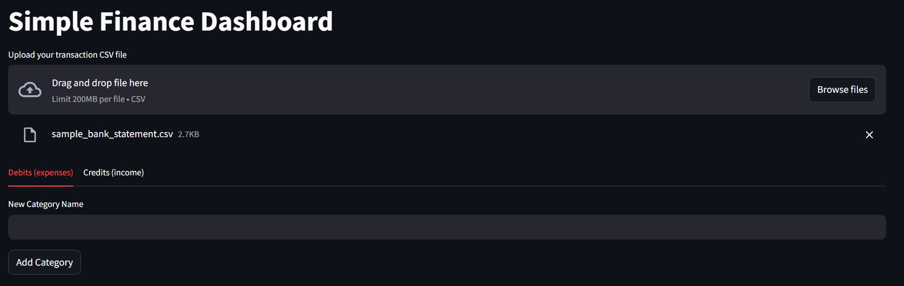
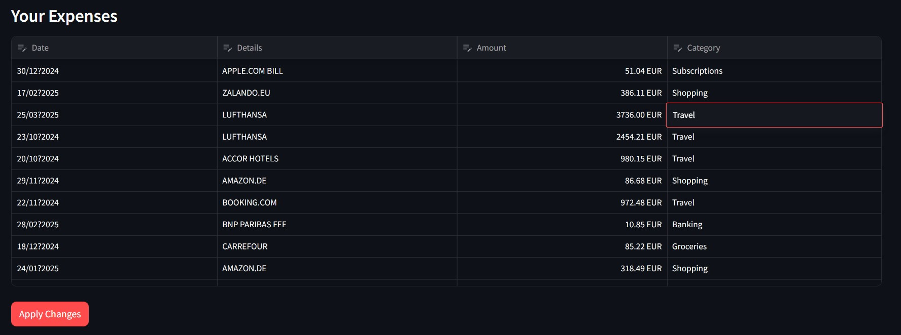
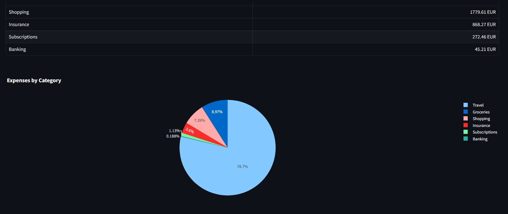

# Automate Finances

A simple Streamlit application designed to help you categorize and visualize personal bank transactions imported from a CSV file.

## Description

This tool allows users to upload their bank statements in CSV format. It automatically categorizes expenses based on predefined keywords associated with categories and provides visualizations to understand spending patterns. Users can also manually categorize transactions and create new categories, with the application learning from these manual assignments for future automatic categorization.

**[➡️ Try the live demo here!](https://finance-automator.streamlit.app/)**

## Features

*   **CSV Upload:** Upload bank transaction data via a CSV file.
*   **Automatic Categorization:** Automatically assigns categories to expenses based on keywords found in transaction details.
*   **Manual Categorization:** Interactively edit and assign categories to expenses using a data editor.
*   **Category Management:** Create new expense categories.
*   **Keyword Learning:** Automatically adds the 'Details' of a manually categorized transaction as a keyword for that category.
*   **Data Visualization:** View expenses summarized by category in a table and an interactive pie chart.
*   **Income Summary:** Displays total income and lists income transactions.
*   **Persistence:** Saves category definitions and associated keywords to `categories.json`.

## Screenshots

Here's a glimpse of the application:


*Upload Interface and Add Category*


*Expense Dashboard and Select Categories*


*Data Visualization*

## Requirements

*   Python >= 3.13
*   Dependencies:
    *   streamlit
    *   pandas
    *   plotly
    *   numpy

## Installation

1.  **Clone this repository**
    

2.  **Create and activate a virtual environment:**
    *   Using `venv`:
        ```bash
        python -m venv .venv
        # On Windows
        .\.venv\Scripts\activate
        # On macOS/Linux
        source .venv/bin/activate
        ```
    *   Using `conda`:
        ```bash
        conda create -n finance_env python=3.13
        conda activate finance_env
        ```

3.  **Install dependencies using `uv` (recommended as `uv.lock` exists):**
    ```bash
    pip install uv
    uv pip install -r requirements.txt  # Or if pyproject.toml is fully configured: uv pip install .
    ```
    *Alternatively, using pip with `pyproject.toml`:*
    ```bash
    pip install .
    ```


## Usage

1.  **Prepare your CSV file:** Ensure your CSV file has the following columns (case-sensitive, check `main.py` if issues arise):
    *   `Date` (e.g., "01 Jan 2024")
    *   `Details` (Description of the transaction)
    *   `Amount` (Numerical value, e.g., "1,234.56" or "1234.56")
    *   `Debit/Credit` ("Debit" for expenses, "Credit" for income)

    A `sample_bank_statement.csv` is included in the repository for reference.

2.  **Run the Streamlit application:**
    ```bash
    streamlit run main.py
    ```

3.  **Upload your CSV file** using the file uploader in the application.

4.  **Interact with the dashboard:**
    *   View expense summaries and visualizations.
    *   Add new categories.
    *   Edit categories directly in the "Your Expenses" table. Changes are saved when you click "Apply Changes".

## How Categorization Works

*   The application maintains a `categories.json` file storing categories and associated keywords.
*   When a CSV is uploaded, the app iterates through the keywords for each category (excluding "Uncategorized").
*   If a transaction's "Details" (case-insensitive) matches a keyword, the transaction is assigned to that category.
*   Transactions not matching any keywords remain "Uncategorized".
*   When you manually change a transaction's category in the table and save, the transaction's "Details" text is added as a new keyword to the selected category in `categories.json`, improving future automatic categorization.
