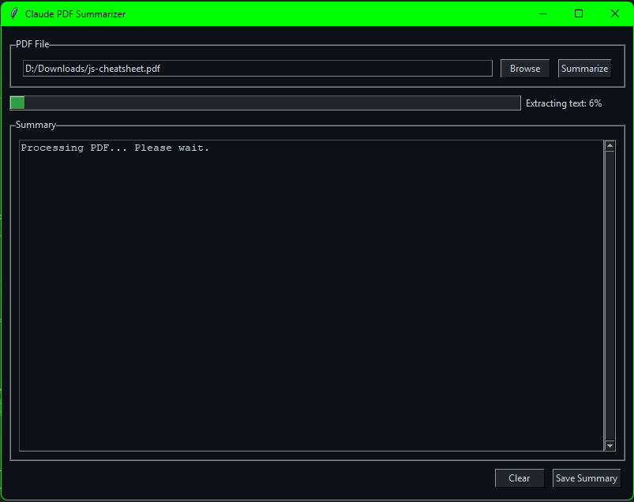

# Claude PDF Summarizer

A Python application that uses Anthropic's Claude AI to generate high-quality summaries from PDF documents.



## Features

- User-friendly GUI interface
- PDF text extraction
- AI-powered summarization using Claude models
- Progress tracking for both extraction and summarization phases
- Summary export to text files
- Comprehensive error handling

## Setup

1. Clone or download the repository
2. Install the required dependencies:

```bash
pip install -r requirements.txt
```

3. Create a `.env` file in the project directory with your Anthropic API key:

```
ANTHROPIC_API_KEY=your_api_key_here
```

To get an API key, sign up at [Anthropic's website](https://www.anthropic.com/).

## Usage

1. Run the application:

```bash
python claude_pdf_summarizer.py
```

2. Use the "Browse" button to select a PDF file
3. Click "Summarize" to process the document
4. View the generated summary in the application window
5. Use "Save Summary" to export the summary as a text file

## How It Works

The summarization process:

1. Extracts text from the PDF using PyPDF2
2. Sends the extracted text to Claude's API
3. Uses a carefully crafted prompt to generate a summary that:
   - Captures the main ideas and key points
   - Uses simple, accessible language
   - Maintains logical flow
   - Is approximately 25% of the original length
   - Breaks down complex concepts into digestible chunks

## Requirements

- Python 3.7+
- PyPDF2
- Anthropic Python SDK
- python-dotenv
- Tkinter (usually included with Python)

## Limitations

- Requires an internet connection and valid Anthropic API key
- API usage may incur costs based on Anthropic's pricing
- PDF must be text-based (not scanned images)
- Very large documents may exceed API token limits
