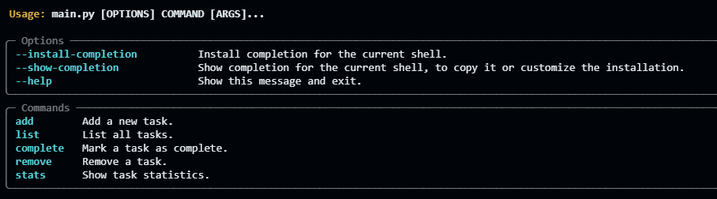

# CLI Todo App 📝

A powerful and simple command-line interface (CLI) task management application built with Python.

## 🌟 Features

- **Add Tasks**: Quickly add new tasks to your todo list
- **List Tasks**: View all tasks with their current status
- **Complete Tasks**: Mark tasks as completed
- **Remove Tasks**: Delete tasks you no longer need
- **Task Statistics**: Get an overview of your task progress
- **Persistent Storage**: Tasks are saved in a SQLite database for data retention

## 🖥️ Screenshot



## 🛠️ Requirements

- Python 3.x
- Dependencies listed in `requirements.txt`

## 🚀 Installation

1. Clone the repository:
```bash
git clone https://github.com/yourusername/cli-todo-app.git
cd cli-todo-app
```

2. Create a virtual environment (optional but recommended):
```bash
python -m venv venv
source venv/bin/activate  # On Windows use `venv\Scripts\activate`
```

3. Install dependencies:
```bash
pip install -r requirements.txt
```

## 📋 Usage

### Add a Task
```bash
python main.py add "Buy groceries"
```

### List Tasks
```bash
python main.py list
```

### Complete a Task
```bash
python main.py complete 1  # Complete task with ID 1
```

### Remove a Task
```bash
python main.py remove 1  # Remove task with ID 1
```

### View Task Statistics
```bash
python main.py stats
```

## 🔧 How It Works

The app uses:
- `typer` for creating the CLI interface
- `sqlite3` for persistent task storage
- Stores tasks in a local `todo.db` database

