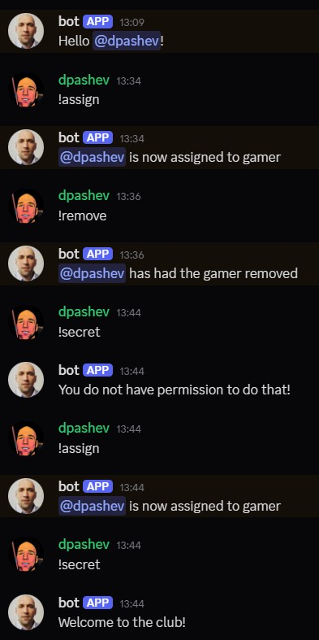

# Discord Bot Project

A simple Discord bot built with Python using the `discord.py` library.

## Features

-   Welcomes new members to the server via direct message.
-   Basic message moderation (detects and removes specific words).
-   Assigns and removes a specific role ("gamer") to users via commands.
-   Allows users to send DMs to themselves via the bot.
-   Can reply directly to user messages.
-   Creates simple polls with yes/no reactions.
-   Includes a role-restricted command.
-   Logs bot activity to `discord.log`.

## Setup and Installation

1.  **Clone the repository (or download the files):**

2.  **Create a virtual environment (recommended):**
    ```bash
    python -m venv venv
    # On Windows
    .\venv\Scripts\activate
    # On macOS/Linux
    source venv/bin/activate
    ```
3.  **Install dependencies:**
    ```bash
    pip install -r requirements.txt
    ```
4.  **Create a `.env` file** in the project root directory and add your Discord Bot Token:
    ```env
    DISCORD_TOKEN=YOUR_BOT_TOKEN_HERE
    ```
    Replace `YOUR_BOT_TOKEN_HERE` with your actual bot token.
5.  **Ensure the "gamer" role exists** on your Discord server, or modify the `secret_role` variable in `main.py` to a role that does exist.

## Running the Bot

Execute the main script:

```bash
python main.py
```

The bot should come online in your Discord server.

## Commands

The default command prefix is `!`.

-   `!hello`: The bot replies with a greeting.
-   `!assign`: Assigns the "gamer" role to you.
-   `!remove`: Removes the "gamer" role from you.
-   `!dm <your message>`: The bot sends your message back to you via DM.
-   `!reply`: The bot replies directly to your command message.
-   `!poll <question>`: Creates a poll with the specified question and adds 👍 / 👎 reactions.
-   `!secret`: (Requires "gamer" role) Sends a secret message.

## Screenshot

Here's a demonstration of some commands:


